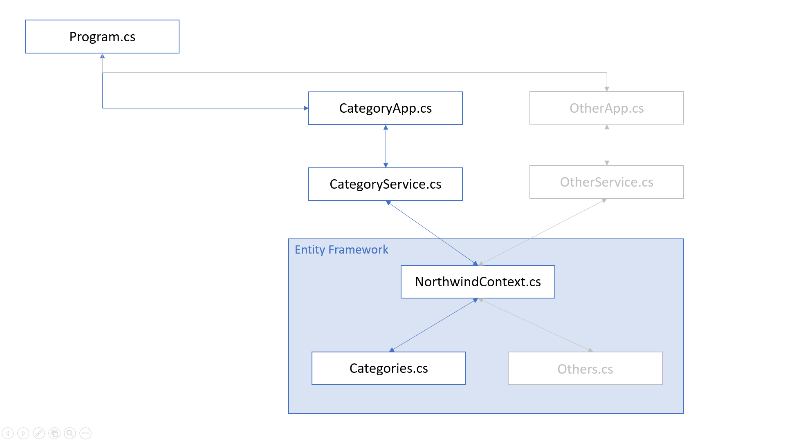

# Lab Entity Framework

This lab will teach you how to use Entity Framework and CRUD in a Console Application.

For this exercise you will **not** create the exercise from scratch. Instead you will update this given repository.

## Prerequisite

- .NET Core runtimes installed (`dotnet info`):

  - Microsoft.AspNetCore.App 3.1.2 [C:\Program Files\dotnet\shared\Microsoft.AspNetCore.App]
  - Microsoft.NETCore.App 3.1.2 [C:\Program Files\dotnet\shared\Microsoft.NETCore.App]
  - Microsoft.WindowsDesktop.App 3.1.2 [C:\Program Files\dotnet\shared\Microsoft.WindowsDesktop.App]

## Setup

- run command `dotnet new console`
- delete Program.cs
- rename MyProgram.cs to Program.cs
- run command `dotnet run` (checking if everything works)
- type `stop`

- install packages:
  - database providers:
    - `dotnet add package Microsoft.EntityFrameworkCore.SqlServer`
    - `dotnet add package Microsoft.EntityFrameworkCore.Design`
- import the NorthWind databases
  - Northwind.sql
- scafold models:
  `dotnet ef dbcontext scaffold "Data Source=639GTQ2\SQLEXPRESS;Initial Catalog=Northwind;Integrated Security=True;" Microsoft.EntityFrameworkCore.SqlServer --output-dir Library\Models`
- the models should be add to the Library
- run command `dotnet run` (checking if everything works)
- type `stop`

## Exercise

### Part 1

Implement the code to apply the CRUD operations on the table Categories of the NorthWind Database.

This is the startscreen when you run the `dot net` command. The application keeps on running until the userinput is "stop".

```bash
Commandlist
------------------------------------------------
stop                  exit application
help                  show commandlist
------------------------------------------------
category:list         show all categories
category:add          add a new category
category:show         show a new category
category:update       update a category
category:delete       delete acategory
------------------------------------------------
```

- **stop:** stop the application
- **help:** show the commandlist again
- **category:list:** show all the categories (id and name) in a list
- **category:add:** add a new category, ask for the name and the description
- **category:show:** show a category by id, ask for an id and show the id, name and description
- **category:update:** update a category, ask for an id (if not found show a message), show the category like in category:show then ask for the name and the decription
- **category:delete:** delete a category, ask for an id (if not found show a message), show the category like in category:show then ask if they are sure (y/n)

Implement at least the classes:

- CategoryApp
- CategoryService



**Don't change the Program.cs, unless you have a very good reason to do this.**

### Part 2 (extra)

Librarify everything what's in the folder Libray in a new project and import it in your application.

### When done:

Upload your application and library to gitlab in your student-name folder.

# Hints and Tricks

- Look at the examples
- Use the cheat sheet on gitlab.
- Use the dotnet cli cheat sheet on gitlab.
- Use the git cheat sheet on gitlab.
